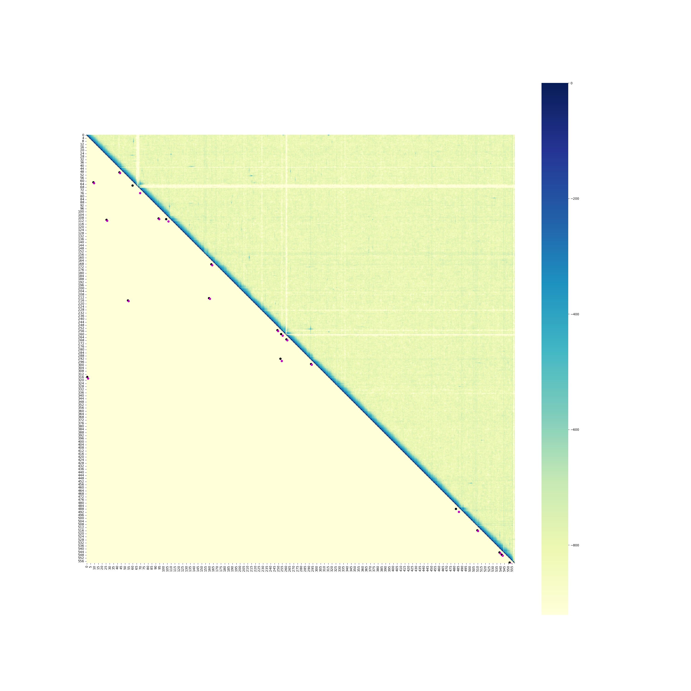
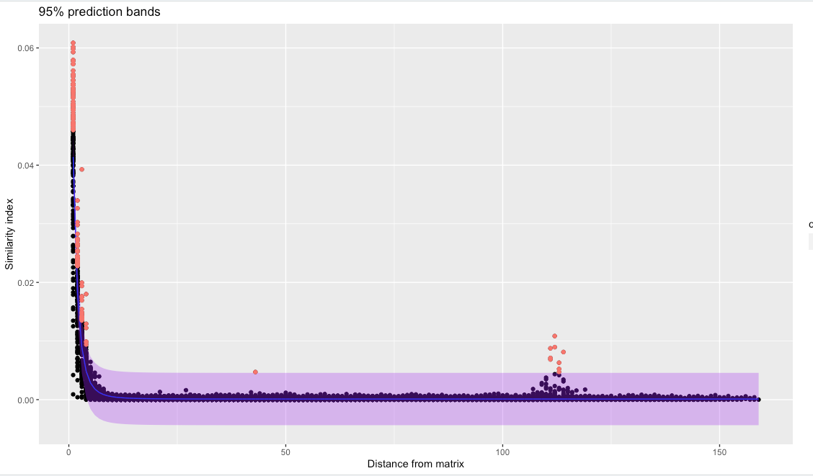

# WRATH: WRapped Analysis of Tagged Haplotypes


---
## Running wrath

The main script `wrath.sh` runs the main version of *WRATH*. The pipeline calculates barcode sharing between windows of a chosen size in a given chromosome. The main pipeline automatically detects SVs larger than 50kbp. Automatic detection of SVs can be turned off if the only output wanted is the heatmap plot of barcode sharing. Recommended window size is 50kbp. 

A typical command looks like:

```bash
wrath.sh -g genome_file.fa -c chromosome_name  -w 50000  -s list_of_bam_files.txt -t 15
```

Input options are:

```
wrath: wrapped analysis of tagged haplotypes

DESCRIPTION:
 Program produces a jaccard matrix camparing the barcode content between all pairs windows whithin a chromosome.

wrath [-h] [-g GENOMEFILE] [-c CHROMOSOMENAME] [-w WINDOWSIZE] [-s FILELIST] [-t THERADS] [-p] [-v] [-x STEP]

OPTIONS:
  -h                show this help text
  -g GENOMEFILE     reference genome
  -c CHROMOSOMENAME chromosome
  -w WINDOWSIZE     window size
  -s FILELIST       list of bam files with paths of the individuals of the population/phenotype of interest
  -t THERADS        threads to use
  -p                skip plotting the heatmap
  -x STEP           start from a given step. Note that this only works if filenames match those expected by wrath. Possible step options are: makewindows, getbarcodes, matrix, outliers or plot
  -v                verbose (only for the matrix generating step)
```


## Requirements

Command line programs:
- [samtools](http://www.htslib.org/)
- [bedtools](https://bedtools.readthedocs.io/en/latest/)

Python:
- [NumPy](https://numpy.org/)
- [Seaborn](https://seaborn.pydata.org/installing.html)
- [matplotlib](https://matplotlib.org/)
- [pandas](https://pandas.pydata.org/)
- [sklearn](https://scikit-learn.org/stable/index.html)

```bash
pip install -U numpy seaborn matplotlib pandas scikit-learn
```

R:
- [ggplot2](https://ggplot2.tidyverse.org/)
- [tidyr](https://tidyr.tidyverse.org/)
- [dplyr](https://dplyr.tidyverse.org/)
- [nlraa](https://github.com/femiguez/nlraa)

In R, run

```R
# The easiest way to get ggplot2, tidyr and dplyr is to install the whole tidyverse:
install.packages("tidyverse")

#and then nlraa
install.packages("nlraa")
```

## Input files

The input necessary is a genome file in fasta format and a list of the sample bam files that need to be analysed including their paths.

Like:
```
/home/samples/bams/group1/sample1.bam
/home/samples/bams/group1/sample2.bam
/home/samples/bams/group2/sample3.bam
/home/samples/bams/group2/sample4.bam
```


## Output

*WRATH* will create a directory with this structure (when running with default options):

```
wrath_out/
├── beds
├── matrices
├── outliers
├── plots
└── SVs
```

### 1. SVs
Table of automatically detected SVs for a given chromosome (in csv format).
Columns include: SV id, chromosome name, start position, end position and SV length.

```
SV_id,chromsome,start,end,length
5,Herato1910,10000,3170000,3160000
15,Herato1910,540000,2160000,1620000
13,Herato1910,260000,1110000,850000
19,Herato1910,90000,620000,530000
16,Herato1910,1600000,2130000,530000
6,Herato1910,2530000,2940000,410000
12,Herato1910,940000,1090000,150000
2,Herato1910,600000,750000,150000
0,Herato1910,4820000,4910000,90000
```

### 2. Plots
Heatmap plot of barcode sharing between windows of a given chromosome. If automatic detection of SVs is used (default option), the lower triangle of the plot will indicate the points where SVs have been detected, while the upper triangle will show barcode sharing between windows.



If automatic detection of SVs is disabled, upper and lower triangle will show the same data, barcode sharing between windows.

### 3. Outliers, matrices and beds
1. Window beds: To calculate barcode sharing between windows, first *WRATH* splits the chromosome in n windows of size m. The coordinates of those windows are stored in a bed file in the directory *beds*.
2. Barcode beds: Barcodes are extracted from the bam files and their leftmost mapping position stored in a gzipped bed file in *beds*. Tabix index are also created.   
3. Matrices: barcode sharing between pairs of windows is calculated and stored in an identity matrix of nxn dimensions. A jaccard index is calculated for each pair of windows:


Where J is the Jaccard distance, and A and B are windows 1 and and 2 respectively.

4. Outliers: we calculate and store the distance of each comparison to the diagonal. Then using this distance and the jaccard index value of the comparison, we fit a double exponential decay model, such that:


The model is fit and 95% prediction bands are calculated from it such that:



Any points above or below the prediction bands are defined as outliers and stored in the *outliers* directory. Several values are stored for each outlier: row number, column number, jaccard distance, y estimate of the model, estimated error, 2.5 quantile, 97.5 quantile and a definition of whether it is an 'upper' or 'lower' outlier.

## Running *WRATH* on multiple chromosomes

The easiest way to run *WRATH* on multiple chromosomes is to run in parallely. If running on a cluster and using a shceduling system such as SLURM, an array can be used to run a job for each chromosome. An example is found in [example array](example_run/example_wrath_slurm_array.sh).
