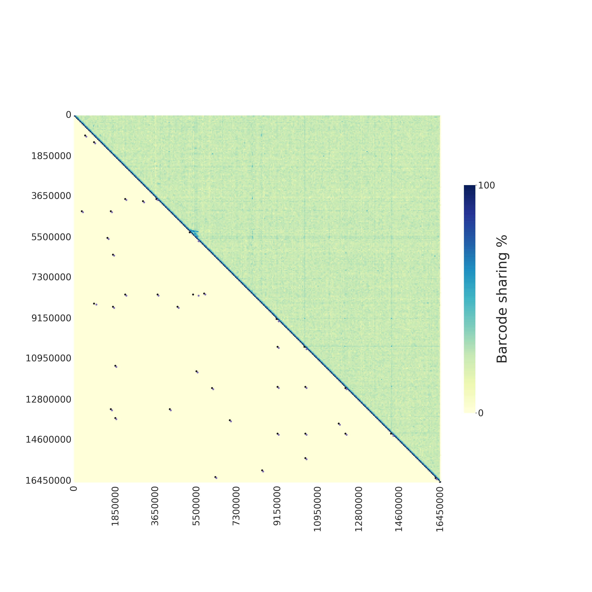

<font size=6>**Wrath: WRapped Analysis of Tagged Haplotypes**</font>


---

Wrath is a program for the visualisation and identification of candidate structural variants (SVs) from linked read data. Wrath calculates barcode sharing between windows of a given chromosome and produces heatmap plots that are useful to explore the data and identify candidate SBs. The pipeline can also automatically detect large SVs by using a double approach of z-scores threasholds and prediction bands from modelling of the data.

<font size=5>**Table of Contents**</font>

- [Running Wrath for Structural Variant detection](#running-wrath-for-structural-variant-detection)
- [Requirements](#requirements)
- [Input files](#input-files)
- [Output](#output)
  - [1. SVs](#1-svs)
  - [2. Plots](#2-plots)
    - [Chromosome plots and SV detection:](#chromosome-plots-and-sv-detection)
    - [Comparison of populations:](#comparison-of-populations)
  - [3. Outliers, Matrices, and Beds](#3-outliers-matrices-and-beds)
- [Running *Wrath* on multiple chromosomes](#running-wrath-on-multiple-chromosomes)
- [Citing Wrath](#citing-wrath)

## Running Wrath for Structural Variant detection

The main script `wrath` runs the main version of *Wrath*. The pipeline calculates barcode sharing between windows of a chosen size in a given chromosome and produces heatmap plots of barcode sharing. The main pipeline can also automatically detect large SVs. Default window size is 50kbp.

To run this scripts barcodes need to be encoded in the BX tag beforehand. To do that you can use the *barcode_parsing* utility.

A typical command looks like:

```bash

wrath -g reference_genome.fa -c chromosome_name  -w 50000  -s list_of_bam_files.txt -t 15

```

Input options are:

```{bash}

Wrath: wrapped analysis of tagged haplotypes

DESCRIPTION:
 Program produces a jaccard matrix camparing the barcode content between all pairs windows whithin a chromosome.

wrath.sh [-h] [-g FASTAFILE] [-c CHROMOSOMENAME] [-w WINDOWSIZE] [-a FILELIST] [-t THREADS] [-p] [-v] [-x STEP] [-l] [-s START] [-e END]

OPTIONS: 
  -h                show this help text
  -g FASTAFILE      reference genome
  -c CHROMOSOMENAME chromosome
  -w WINDOWSIZE     window size
  -a FILELIST       list of bam files with paths of the individuals of the population/phenotype of interest
  -t THREADS        threads to use
  -p                skip plotting the heatmap
  -x STEP           start from a given step. Note that this only works if filenames match those expected by wrath. Possible step options are: makewindows, getbarcodes, matrix, outliers (only if -l given) or plot
  -l                automatic detection of SVs
  -v                verbose (only for the matrix generating step)
  -s START          start position to subset windows
  -e END            end position to subset windows
```

## Requirements

Command line programs:

- [samtools](http://www.htslib.org/)
- [bedtools](https://bedtools.readthedocs.io/en/latest/)

Python:

- [NumPy](https://numpy.org/)
- [Seaborn](https://seaborn.pydata.org/installing.html)
- [matplotlib](https://matplotlib.org/)
- [pandas](https://pandas.pydata.org/)
- [sklearn](https://scikit-learn.org/stable/index.html)
- [pysam](https://pysam.readthedocs.io/en/latest/installation.html)

```bash
pip install -U numpy seaborn matplotlib pandas scikit-learn pysam
```

R:

- [ggplot2](https://ggplot2.tidyverse.org/)
- [tidyr](https://tidyr.tidyverse.org/)
- [dplyr](https://dplyr.tidyverse.org/)
- [nlraa](https://github.com/femiguez/nlraa)

In R, run

```R
# The easiest way to get ggplot2, tidyr and dplyr is to install the whole tidyverse:
install.packages("tidyverse")

#and then nlraa
install.packages("nlraa")
```

## Input files

The input necessary is a reference genome  in fasta format and a list of the sample bam files that need to be analysed including their paths.

Like:

```{bash}
/home/samples/bams/group1/sample1.bam
/home/samples/bams/group1/sample2.bam
/home/samples/bams/group2/sample3.bam
/home/samples/bams/group2/sample4.bam
```

## Output

*Wrath* will create a directory with this structure (when running with default options):

```{bash}
wrath_out/
├── beds
├── matrices
├── outliers
├── plots
└── SVs
```

### 1. SVs

Table of automatically detected SVs for a given chromosome (in csv format).
Columns include: SV id, chromosome name, start position, end position and SV length.

```{bash}
SV_id,chromsome,start,end,length
5,Herato1910,10000,3170000,3160000
15,Herato1910,540000,2160000,1620000
13,Herato1910,260000,1110000,850000
19,Herato1910,90000,620000,530000
16,Herato1910,1600000,2130000,530000
6,Herato1910,2530000,2940000,410000
12,Herato1910,940000,1090000,150000
2,Herato1910,600000,750000,150000
0,Herato1910,4820000,4910000,90000
```

### 2. Plots

#### Chromosome plots and SV detection:

Heatmap plot of barcode sharing between windows of a given chromosome. If automatic detection of SVs is used, the lower triangle of the plot will indicate the points where SVs have been detected, while the upper triangle will show barcode sharing between windows.



If automatic detection of SVs is not enabled, the upper triangle will show barcode sharing between windows and lower triangle will be empty.

#### Comparison of populations:

If comparing two populations that differ in a structural variant, it can be useful to plot the barcode sharing between windows of the two populations. This can be done by using the script [sv_detection/plot_2matrices_tegether.py](sv_detection/plot_2matrices_tegether.py) and providing a list of bam files for each population. The plot will show the barcode sharing between windows of each population, one in the upper triangle and the other in the lower triangle.


### 3. Outliers, Matrices, and Beds

1. **Window Beds:** To calculate barcode sharing between windows, first *Wrath* splits the chromosome into n windows of size m. The coordinates of those windows are stored in a bed file in the directory *beds*.

2. **Barcode Beds:** Barcodes are extracted from the bam files, and their leftmost mapping position is stored in a gzipped bed file in *beds*. Tabix indexes are also created.

3. **Matrices:** Barcode sharing between pairs of windows is calculated and stored in an identity matrix of nxn dimensions. A Jaccard index is calculated for each pair of windows:

    

   Where J is the Jaccard distance, and A and B are windows 1 and 2, respectively.

1. **Outliers:** We calculate and store the distance of each comparison to the diagonal. Then, using this distance and the Jaccard index value of the comparison, we calculate z scores and, separately, we fit a double exponential decay model, such that:

    

   The model is fit, and 95% prediction bands are calculated from it such that:


Any points outside the z score threshold (2 by default) **and** above or below the prediction bands are defined as outliers and stored in the *outliers* directory. Z score threashold and predition bands can be changed in the script *outliers.R*.

Several values are stored for each outlier: row number, column number, jaccard distance, y estimate of the model, estimated error, 2.5 quantile, 97.5 quantile and a definition of whether it is an 'upper' or 'lower' outlier.

## Running *Wrath* on multiple chromosomes

The easiest way to run *Wrath* on multiple chromosomes is to run in parallely. If running on a cluster and using a shceduling system such as SLURM, an array can be used to run a job for each chromosome. An example is found in [example array](example_run/example_wrath_slurm_array.sh).

## Citing Wrath

If you use Wrath please cite the our preprint on bioRxiv:

Transposable element insertions are associated with Batesian mimicry in the pantropical butterfly Hypolimnas misippus
Anna Orteu, Marek Kucka, Eunice Katili, Charo Ngumbao, Ian J. Gordon, Ivy Ng’iru, Eva van der Heijden, Gerard Talavera, Ian A. Warren, Steve Collins, Richard H. ffrench-Constant, Dino J. Martins, Yingguang Frank Chan, Chris D. Jiggins, Simon H. Martin
bioRxiv 2023.07.10.548380; doi: https://doi.org/10.1101/2023.07.10.548380